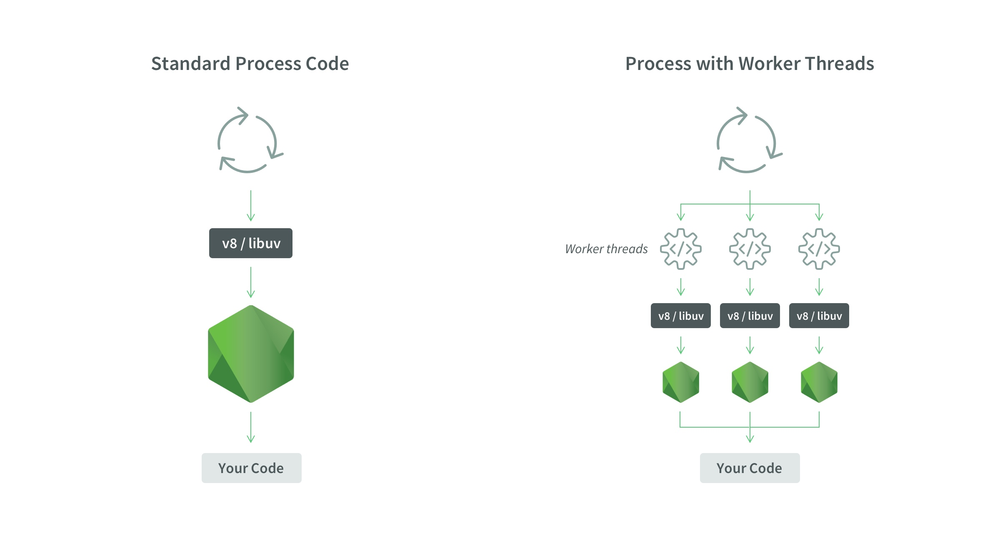

# USE THREADS IN NODE JS.


### Objective
- Execute a blocking operation in nodejs
- Execute the same blocking operation, but using threads


Run:

To simulate an operation that blocks nodejs to use only one thread.
```sh
node block-nodejs/index.mjs
```

Solution to not block nodejs, using threads.
```sh
node use-threads/index.mjs
```

